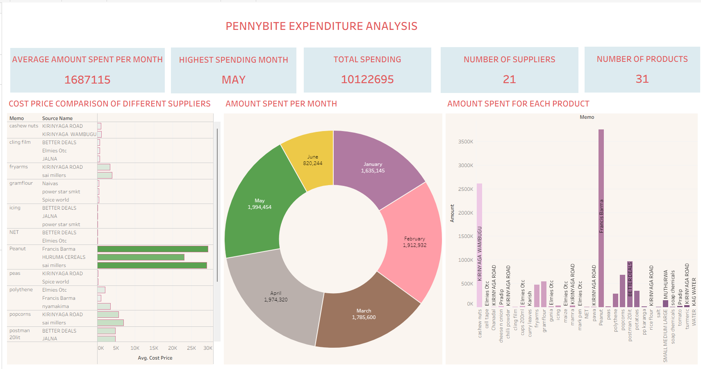

# 📊 PennyBite Expenditure Analysis

An end-to-end expenditure analysis project built using Microsoft Excel to help a small business understand its purchasing patterns, monitor spending, compare supplier prices, and identify opportunities for cost savings.

---

# 📌 Project Overview

Businesses generate large amounts of purchasing data every month, but without proper analysis it can be difficult to identify spending trends or make informed purchasing decisions.

This project analyzes expenditure data exported from QuickBooks and transforms it into an interactive Excel dashboard that provides actionable insights into business spending.

The dashboard allows stakeholders to:

- Monitor monthly expenditure
- Compare supplier prices
- Identify the highest-cost products
- Support better purchasing decisions

---

# 🎯 Business Questions

This project answers the following questions:

1. What is the average amount spent each month?
2. Which month recorded the highest expenditure?
3. Which products contribute the most to total spending?
4. Which suppliers offer the lowest average prices for the same products?
5. Which products are purchased from multiple suppliers?
6. Which suppliers are the most frequently used?
7. Where are the biggest opportunities for cost savings?

---

# 📂 Dataset

**Source**

QuickBooks Purchase Data

The dataset contains purchase transactions made by a small business over a six-month period.

### Main Fields

- Purchase Date
- Product Name
- Supplier Name
- Unit Cost
- Quantity
- Total Amount
- Memo

*Note: This dataset has been used for educational and portfolio purposes.*

---

# 🛠 Tools Used

- Microsoft Excel
- Pivot Tables
- Pivot Charts
- Slicers
- Excel Formulas
- Data Cleaning Techniques
- Tableau

---

# 🧹 Data Cleaning

Before performing the analysis, the following data preparation steps were completed:

- Removed duplicate records
- Checked for missing values
- Standardized supplier names
- Formatted date fields
- Verified numerical data types
- Cleaned inconsistent product names

---

# 📈 Dashboard Features

The dashboard contains three primary analyses.

## 1. Cost Price Comparison of Different Suppliers

This visualization compares the average prices offered by different suppliers for the same products.

**Purpose**

- Identify the most cost-effective supplier
- Detect pricing differences
- Support supplier negotiations

---

## 2. Amount Spent Per Month

A monthly expenditure breakdown showing spending trends over the reporting period.

**Purpose**

- Monitor monthly spending
- Identify unusually high expenditure months
- Support budgeting decisions

---

## 3. Amount Spent for Each Product

Displays the total expenditure by product.

**Purpose**

- Identify products consuming the largest share of the budget
- Detect high-cost inventory items
- Prioritize purchasing reviews

---

# 📊 Dashboard Preview



---

# 🔍 Key Insights

From the analysis:

- Monthly spending fluctuates throughout the reporting period.
- A small number of products account for a significant proportion of total expenditure.
- Some suppliers charge noticeably different prices for identical products.
- Certain products are consistently purchased from multiple suppliers, creating opportunities for price comparison and supplier optimization.

---

# 💡 Recommendations

Based on the findings, the business should:

- Purchase frequently ordered products from the lowest-cost supplier.
- Regularly monitor monthly expenditure trends.
- Review high-spending products to identify opportunities for cost reduction.
- Standardize supplier selection where pricing differences are significant.
- Continue using dashboards to monitor purchasing performance over time.

---

# 📁 Repository Structure

```
PennyBite-Expenditure-Analysis/

│

├── Data/
│   └── BELLO ORWA 2.xlsx
│
├── Dashboard/
│   └── Dashboard Screenshot.png
│
├── README.md
│
└── PennyBite Expenditure Analysis.xlsx
```

---

# 🚀 How to Use

1. Download the Excel workbook.
2. Open it using Microsoft Excel.
3. Navigate to the Dashboard worksheet.
4. Explore the charts and interact with any available filters or slicers.

---

# 📚 Skills Demonstrated

This project demonstrates proficiency in:

- Data Cleaning
- Data Analysis
- Business Intelligence
- Data Visualization
- Excel Dashboard Design
- Pivot Tables
- Pivot Charts
- Analytical Thinking
- Business Reporting

---

# 📌 Future Improvements

Potential enhancements include:

- Build an interactive Power BI dashboard
- Perform supplier performance analysis
- Create spending forecasts
- Automate data cleaning using Power Query
- Perform SQL analysis for larger datasets

---

# 👩‍💻 Author

**Beryl Amimo**

Data Analyst

GitHub: https://github.com/Bee229

---

# ⭐ Acknowledgements

This project was created as part of my data analytics portfolio to demonstrate practical business analysis using Microsoft Excel.
